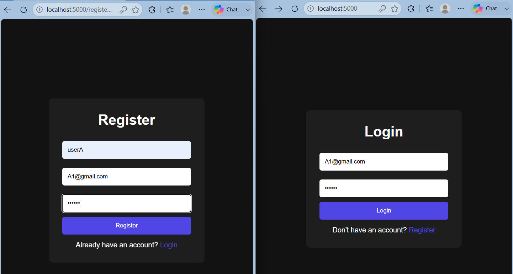
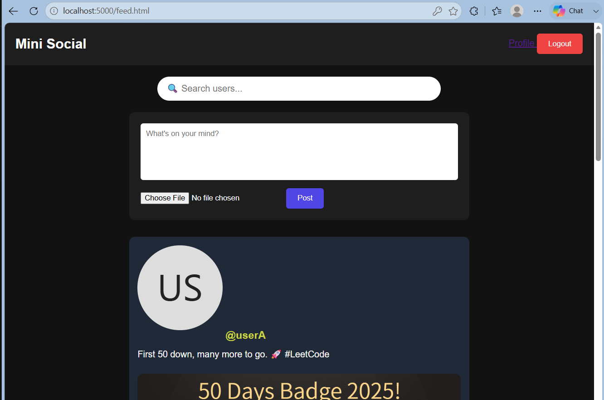
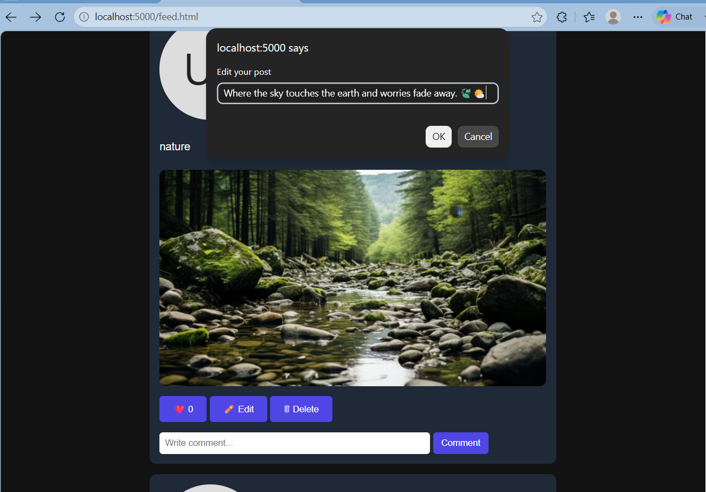

# CodeAlpha Social Media Platform

A full-stack social media platform built using:

- Node.js
- Express.js
- MongoDB
- JWT Authentication
- HTML
- CSS
- JavaScript

## Features

- User Registration & Login
- JWT Authentication
- Create Posts
- Upload Images
- Like / Unlike Posts
- Comment System
- Follow / Unfollow Users
- User Profiles
- Profile Picture Upload
- Search Users
- Edit Posts
- Delete Posts

## Register & Login Page

 

## Home Page

## Edit Posts

## Tech Stack

Frontend:
- HTML
- CSS
- JavaScript

Backend:
- Node.js
- Express.js

Database:
- MongoDB Atlas
